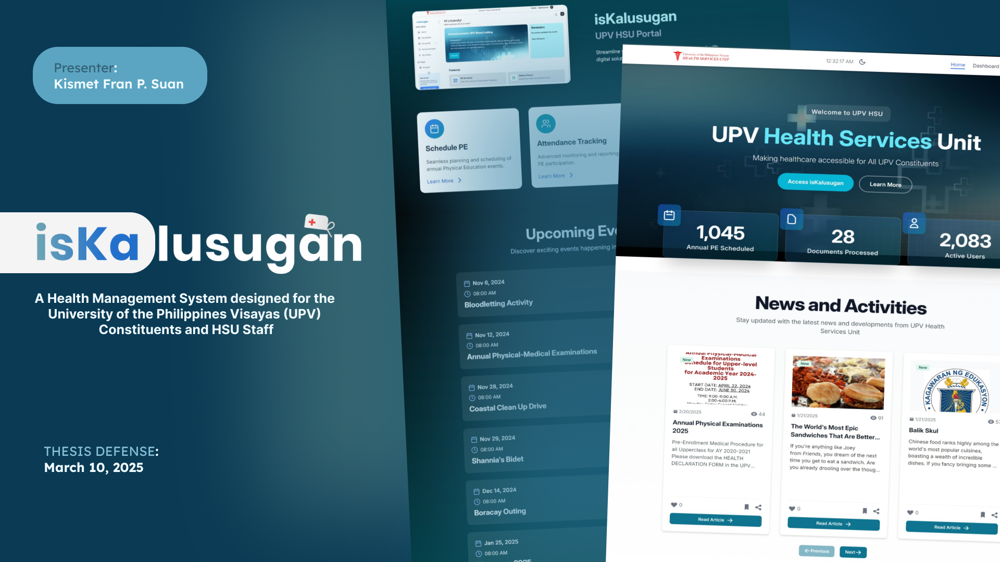

<h1>isKalusugan:  A Proposed Health Services Unit
 Management System for the University of the
 Philippines Visayas</h1>
 
 This study presents the design and implementation of a web-based manage
ment system particularly managing the Annual Physical Examinations for
 the Health Services Unit (HSU) at the University of the Philippines Visayas
 (UPV). The system enhances efficiency, accessibility, and communication
 by streamlining annual health examinations, optimizing scheduling, and im
proving service flow. Key features include online and in-person examination
 options, a scheduling system, a queueing system to manage no-shows, and a
 rescheduling feature with validation controls. Additionally, an announcement
 panel, events section, and documents repository facilitate seamless infor
mation dissemination. Usability testing conducted with UPV Constituents
 yielded a System Usability Scale (SUS) score of 88.75 , indicating an above
average and excellent user experience for the developed system

<h3>Tech Stack</h3>
Mongodb, express, ReactJS, nodejs
  Firebase - Storage for the storing image and files
  Firebase - Authentication for the logins and signups using google

<h3>Presentation: </h3>
https://www.canva.com/design/DAGfRdLf6E8/wQpiZYHPC2KHYDC_D4fNFA/view?utm_content=DAGfRdLf6E8&utm_campaign=designshare&utm_medium=link2&utm_source=uniquelinks&utlId=h0d56198d1d

<h3>How to Run</h3>
To install dependencies:
npm install

cd client
\client\npm install

cd api
\api\npm install 

To build frontend: 
\client
\npm run dev 

To build backend: 
\api
\nodemon index.js
